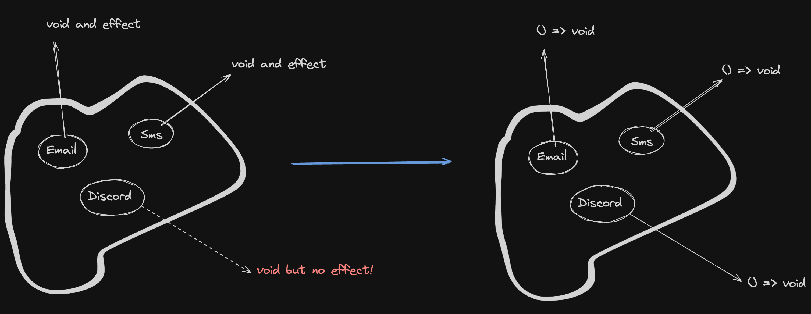
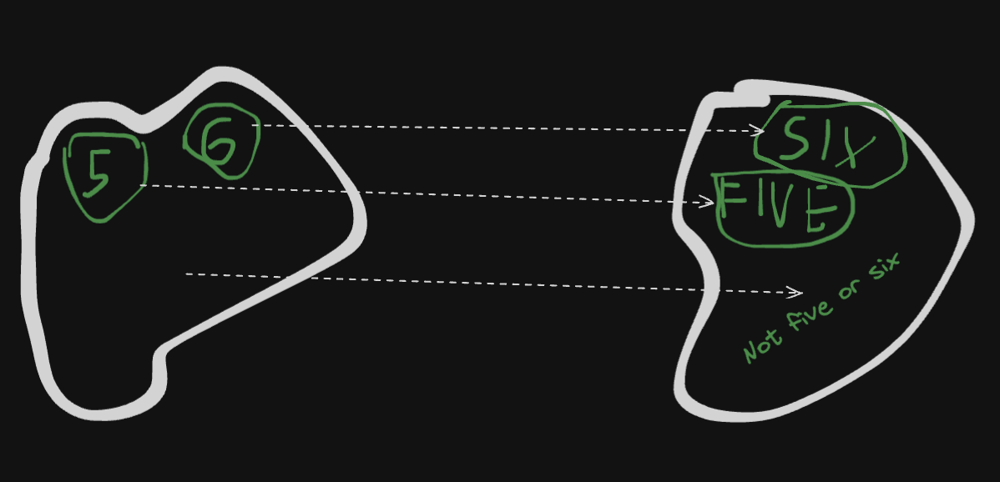
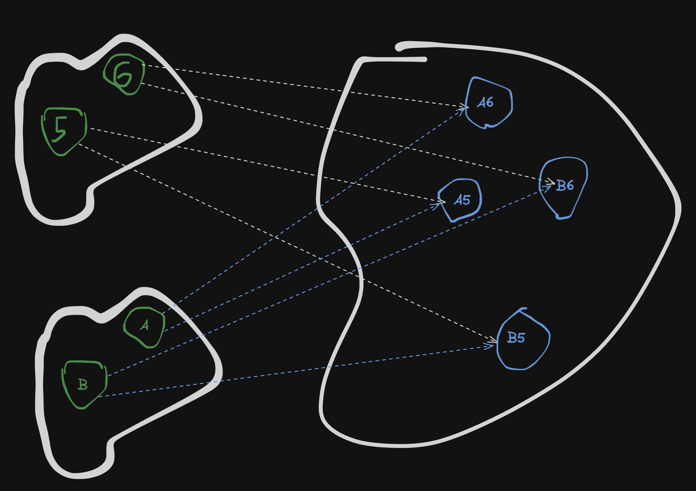
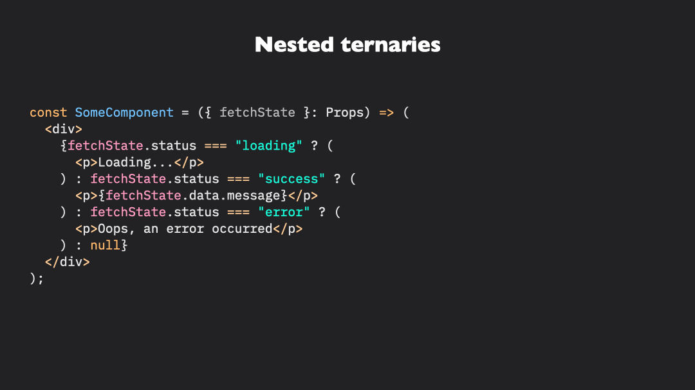

# Functional programming in Typescript: mindfulness in code branching. Pattern matching, exhaustiveness, and side effects. 2/2

In the [first post](https://www.loskutoff.com/never-have-i-ever-1/), I've introduced the concept of exhaustiveness checking and explored some of the ways to branch in Typescript.

Here, I'd like to explore the topic a bit more: I'll talk about why Typescript if/else and switch/case lacking and of the ways to improve it.

You'll see what's "functional" about the way of handling if/else the way I'll propose.

I'll talk about if/else statement vs expressions, and through this naturally cycle back to the topic of exhaustiveness checking from the previous post.

I'll also present the case that the "absurd" technique from the first post is not needed in most situations, and that if we go more "functional", not needed at all.

## Statements vs expressions

Let's take a look at the if/else in Rust:

```rust
let result = if condition { value1 } else { value2 };
```

If/else can produce a value, that can be assigned to a variable, passed to a function, or returned from a function. 

Having a value returned from a conditional expression makes the code more expressive, its intent clearer. 
Not unlike with functions: compare a function that reassigns a variable somewhere in the outer scope, with a function that returns a value.

```typescript
let result: null | number = null;
function reassign() {
  result = 1;
}

function returning(): number {
  return 2;
}
```

To find out what "reassign" does, you have to read its code. 

To find out what "returning" does though, or at least to have a clue on its intent, you only need to glance at its declaration: `function returning(): number`.

The `function reassign()` changes "something somewhere", whereas the `function returning(): number` gives a result that you're free to use further immediately.

The function `returning` is an instance of a pure function: it depends only on its input (which is nothing in this case) and produces a result, not changing anything else outside its scope.

In practice (and in theory too) you can do much more useful things with pure functions than with their impure counterparts.

Pure functions are predictable and easier to test, always producing the same output for given inputs. They avoid side effects, enhancing code reliability and maintainability.

### Separation of concerns

Here's a counterexample to this that you can easily encounter in real-world code:

```
// pseudocode
match transaction:
    case Purchase(item, price, quantity):
        total = price * quantity
        updateInventory(item, -quantity)
        recordSale(total)
    case Refund(order_id, amount):
        refundAmount(order_id, amount)
        updateCustomerBalance(order_id, amount)
    case Transfer(from_account, to_account, amount):
        debitAccount(from_account, amount)
        creditAccount(to_account, amount)
    default:
        logUnknownTransaction(transaction)

```

Asynchronous computations, business logic, matching, probably transactions - all mixed up together!

How nice would it be to separate at least one concern? That's what this post (and, to an extent, the previous one) is about.

### Syntax problems

Now, if you squint hard enough, you might notice that the code

```rust
let result = if condition { value1 } else { value2 };
```

behaves a lot like a pure function: it depends on condition, value1 and value2 and produces a result.

Many other languages, such as OCaml, Haskell, and Scala, have similar semantics to if/else.

Many others though, such as C++, Java, and Javascript/Typescript, can't produce a value from an if/else. 
In this case, if/else is called a **statement**: **a syntactic unit that performs an action**.

This Javascript code won't work:
```javascript
const result = if (x > 0) { return 1 } else { return 2 };
```

But this one will:
```javascript
let result: null | number = null;
if (x > 0) {
  result = 1;
} else {
  result = 2;
}
```

Javascript' if/else doesn't have the necessary properties to be compared with a pure function. Again, it starts "changing something somewhere", and you never know what until you read the source code.

This implementation of conditional expression makes it unnecessarily harder to reason about the code.

Can we do better?

### Ternaries

The simplest solution to turn a "statement" if/else into an "expression" in Javascript is to convert it into a ternary expression:

```typescript
const result = n > 0 ? 1 : 2;
```

Ternaries are great but they have a few drawbacks: 

- first, it's hard to follow the code when even a little bit of nesting is involved:

```typescript
const result = n > 0 ? 1 : n < 0 ? -1 : 0;
```

- second, since the values in the expression aren't always already computed and thus require a multiline computation, ternaries become hard to read and/or require extra tricks to make them work:

```typescript
const getX = () => {
  // multiple lines of procuring x
  return x;
};
const getY = () => {
  // multiple lines of procuring y
  return y;
};
// move the computations into its own functions
const result1 = n > 0 ? getX() : getY();

// or use an IIFE
const result2 = n > 0 ? (() => {
  // multiple lines of procuring x
  return x;
})() : (() => {
  // multiple lines of procuring y
  return y;
})();
```

> A word about [IIFE](https://developer.mozilla.org/en-US/docs/Glossary/IIFE): it's an acronym for Immediately Invoked Function Expression. It's a function that is executed immediately after creation. It allows to produce a value from a multiline computation without defining a named function anywhere. You can inline it anywhere. Drawback is that it's a bit harder to read.

### Function wrapping

We also can just wrap the whole if/else in a function:

```typescript
function f(n: number): number {
  if (n > 0) {
    return 1;
  } else {
    return 2;
  }
}
```

This approach is pretty popular: you can (squinting hard enough) see this pattern in Redux and React's useReducer, amongst many other places.

```typescript
function reducer(state: State, action: Action): State {
  if (action.type === 'INCREMENT') {
    return { ...state, count: state.count + 1 };
  } else if (action.type === 'DECREMENT') {
    return { ...state, count: state.count - 1 };
  } else {
    return state;
  }
}
```

I see switch/case used more often than if/else:

```typescript
function reducer(state: State, action: Action): State {
  switch (action.type) {
    case 'INCREMENT':
      return { ...state, count: state.count + 1 };
    case 'DECREMENT':
      return { ...state, count: state.count - 1 };
    default:
      return state;
  }
}
```

## Exhaustiveness checking

In the React reducer example above, I've used a `default` case to handle any action that isn't handled by the previous cases.

In practice though, you'll rarely want to do that. Having a default case strips you of a very important feature: exhaustiveness checking.

> So, as I promised, we circled back to the topic of exhaustiveness from the previous post.

Assume you have two actions: `INCREMENT` and `DECREMENT` and the reducer above.

Now, you add a third action: `RESET`. Remembering to add the `RESET` case to the reducer is completely up to you. The compiler won't remind you of that. In a large code base, with a lot of concurrent features and tasks to think about, it's really easy to forget things such as this.

Conversely, if your reducer was defined without the default case, such as the following:

```typescript
function reducer(state: State, action: Action): State {
  switch (action.type) {
    case 'INCREMENT':
      return { ...state, count: state.count + 1 };
    case 'DECREMENT':
      return { ...state, count: state.count - 1 };
  }
}
```

Remember the `absurd` function from the previous post? You won't really need it here, as long as you have a return type.

Adding a `RESET` action type without catering to it in would mean that at the end of switch/case, there's still a possible `action.type` `RESET` that makes the function to be able to return `undefined`, which contradicts its return type (`State`) thus won't (fortunately) compile.

So, the solution seems to be right here: just explicitly declare the return types, right?

But that'll blow up when your function is an effect:

```typescript
function handle(event: Event): void {
  switch (event.provider) {
    case 'email':
      sendEmail(event.recipient, event.subject, event.body);
      break;
    case 'sms':
      sendSMS(event.phoneNumber, event.message);
      break;
  }
}
```

`void` doesn't really help here. To catch the non-exhaustiveness in compile time, we again have to "`absurd`".

And `void` being not very useful makes sense: with it, the compiler is made to check "is every branch of the computation doing nothing?" that's much more difficult feat to achieve than "is every branch doing (returning) a specific thing?"

Let's try to change "the compiler checks if branches are doing nothing" to "the compiler checks if branches are doing a specific thing" for `void`-returning, effectful functions.

If not for science, but at least for obtaining better intuition of our computations.

How can we do it? Let's reframe the question: **can we solve the problem later**?

### Exhaustiveness with return types vs. side effects


Instead of dealing with the exhaustiveness problem on `void`s with explicit checks, we instead can postpone the solution:

```typescript
function handle(event: Event): () => void {
  switch (event.provider) {
    case 'email':
      return () => sendEmail(event.recipient, event.subject, event.body);
    case 'sms':
      return () => sendSMS(event.phoneNumber, event.message);
  }
}
```



This code ensures that every event.provider type is handled! There's no "holes" in the type system anymore.

It's up to someone else (well, some other part of the application) to actually run the returned side effect `() => void`.

```typescript
const effect = handleEvent(event);
effect(); // or whenever you want to call it / however many times you want
```

This method allows nicer separation of context: the match itself happens in one place, the execution happens in another. This idea is explored a bit more in the previous post. TLDR, mapping code does only one job: mapping.



To prevent inconvenient occasions such as developers calling `handleEvent(event)` without handling the result, some simple eslint rules have to be applied.

One implementation is [eslint-plugin-functional](https://github.com/eslint-functional/eslint-plugin-functional), specifically its `no-expression-statements` rule with `ignoreVoid: true` option.

```typescript
// error: the return type isn't handled and isn't void
handleEvent(event);
```

This all may be a bit of a hassle to introduce in larger already written codebase, but you don't have to: for effectful matches, you can just fall back to the `absurd` technique.

### This is absurd!

Now, of course, we also could've just used the `absurd` technique for the reducer example above:

```typescript
function reducer(state: State, action: Action) {
  switch (action.type) {
    case 'INCREMENT':
      return { ...state, count: state.count + 1 };
    case 'DECREMENT':
      return { ...state, count: state.count - 1 };
    default:
      absurd(action);
  }
}
```

But having explicit return types is much better for readability.

We could also combine return types and `absurd`, but that'll be extra unnecessary work. I recommend using either or.

Which technique to use boils down to your preference, project size, code style, etc.

## Multiple fields matching



We often want to match on multiple fields, e.g.

```typescript
type Notification =
  | { type: 'email'; format: 'html'; recipient: string; subject: string; body: string }
  | { type: 'email'; format: 'plain'; recipient: string; subject: string; body: string }
  | { type: 'sms'; phoneNumber: string; message: string };

const handle = (notification: Notification) => {
  switch (notification.type) {
    case 'email':
      switch (notification.format) {
        case 'html':
          sendEmail(notification.recipient, notification.subject, notification.body);
          break;
        case 'plain':
          sendEmail(notification.recipient, notification.subject, notification.body);
          break;
        default:
          absurd(notification);
      }
      break;
    case 'sms':
      sendSMS(notification.phoneNumber, notification.message);
      break;
    default:
      absurd(notification);
  }
}
```

While it's fine for smaller types, this method becomes unwieldy for larger ones. The amount of checks grows exponentially. 

### ts-pattern

For more complex match logic, there's already a userland library called [ts-pattern](https://github.com/gvergnaud/ts-pattern).



> The gif above and code below are from the [ts-pattern](https://github.com/gvergnaud/ts-pattern) repository.

The gif above demonstrates the core functionality very well.

With this library, you both have (optional) exhaustiveness and expression semantics.

More than that, you also have selectors that allow you to immediately procure some deeper value from a structure that you matching over.

```tsx
import { match, P } from 'ts-pattern';

type Data =
  | { type: 'text'; content: string }
  | { type: 'img'; src: string };

type Result =
  | { type: 'ok'; data: Data }
  | { type: 'error'; error: Error };

const result: Result = ...;

const html = match(result)
  .with({ type: 'error' }, () => <p>Oups! An error occured</p>)
  .with({ type: 'ok', data: { type: 'text' } }, (res) => <p>{res.data.content}</p>)
  .with({ type: 'ok', data: { type: 'img', src: P.select() } }, (src) => )
  .exhaustive();
```

Notice `P.select()`: it'll carry over the value of `src` into the callback where you run your logic.

Current downside of this library is that it's much slower than the native switch/case. I personally use it for non-performance-critical code paths.

## Bonus: OOP exhaustiveness

There's a way to achieve exhaustiveness without explicitly matching over the structure.

I don't recommend using this technique and including it just for completeness.

This is called a [visitor pattern](https://refactoring.guru/design-patterns/visitor/typescript/example).

I personally always had problems with reading this OOP pattern. No years of experience helped with it.

If you struggle too, I'll give you the key to understanding it.

First, the code:

```typescript

interface Animal {
  getSound(): string;
}

class Dog implements Animal {
  woof(): string {
    return 'woof';
  }

  getSound(): string {
    return this.woof();
  }
}

class Cat implements Animal {
  meow(): string {
    return 'meow';
  }

  getSound(): string {
    return this.meow();
  }
}

interface AnimalVisitor<R> {
  visitDog(dog: Dog): R;

  visitCat(cat: Cat): R;
}

interface Animal {
  accept<R>(visitor: AnimalVisitor<R>): R;
}

class Dog implements Animal {
  woof(): string {
    return 'woof';
  }

  accept<R>(visitor: AnimalVisitor<R>): R {
    return visitor.visitDog(this);
  }
}

class Cat implements Animal {
  meow(): string {
    return 'meow';
  }

  accept<R>(visitor: AnimalVisitor<R>): R {
    return visitor.visitCat(this);
  }
}

class MakeSoundVisitor implements AnimalVisitor<string> {
  visitDog(dog: Dog): string {
    return dog.woof();
  }

  visitCat(cat: Cat): string {
    return cat.meow();
  }
}

class CanClimbTreesVisitor implements AnimalVisitor<boolean> {
  visitDog(dog: Dog): boolean {
    // we roll back to interface behaviour if we do it this way:
    // return dog.canClimbTrees();
    // but it knows about dog structure anyways so...
    return false;
  }

  visitCat(cat: Cat): boolean {
    return true;
  }
}
```

> "Visitor isn’t a very common pattern because of its complexity and narrow applicability."
> 
>>https://refactoring.guru/design-patterns/visitor/typescript/example

The key to cracking this OOP code for me was asking a question: "how do I add another entity?". It helps to think of it in "dymanic" terms:

```typescript
class FoodVisitor implements AnimalVisitor<boolean> {
  visitCat(cat: Cat): boolean {
    return cat.eatMice();
  }
  visitDog(dog: Dog): boolean {
    return dog.eatCats(); // OOP world is unnecessary cruel
  }
}
```

If we think about it in the terms of "what it does", we quickly realize that it does the same thing as matching, just in overly complex fashion.

I think this patter was originally designed to be used in the languages that have no exhaustive matching. For Typescript I believe it's overkill and unnecessary complexity.

## Conclusion

In this post, I've deepened the topic of exhaustiveness checking and introduced expressions vs. statements with side effects.

I've talked about different ways to achieve exhaustiveness such as leveraging the `never` type and explicitly declaring return types, as well as using effects `() => void`.

I've glanced over the ts-pattern library and also gave some insight into the OOP visitor pattern.

Hopefully, this post could be useful and inspiring to some of you. I'd love to hear your thoughts!